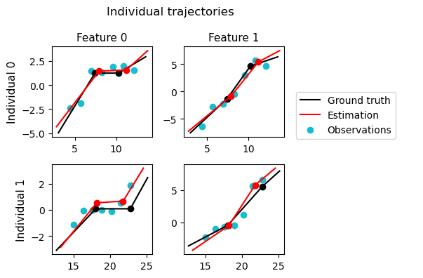

# Longitudinal Segmented Regression

This repository provides tools and algorithms for the estimation and the selection of statistical models for longitudinal data, where the trajectory of each individual is modeled as an affine trajectory.

<p align="center">
  
</p>

## Requirements

The code was tested on Python 3.9. In order to run the code, the Python packages listed in `requirements.txt` are needed. They can be installed for instance with `conda`:

```sh
conda create -n lsr --file requirements.txt
conda activate lsr
```

## Getting started

### Ready-made scripts

This repository contains two code examples. A Python script [`script_demo.py`](script_demo.py), which
runs with `python script_demo.py`, performs the standard pipeline for model estimation and selection.
Additionally, a Jupyter notebook [`Demo.ipynb`](Demo.ipynb) provides a more detailed exposition and specific use cases.

### An example

Estimating the model parameters from input data is achieved in a couple of lines.
Suppose that the variable `y` contains a list of observation sequences,
and `t` contains a list of the related observation times. The model can be estimated as follows:

```python
from src_exp.model import get_prior
from src_exp.saem import MCMC_SAEM

y = ... # observations
t = ... # observation times

K = ... # Desired number of breaks in the trajectory
d = len(y[0][0]) # data dimension

# First, define the prior
prior = get_prior(K=K, d=d) # get_prior gives a default prior, but others can be defined

# Next, run the SAEM algorithm
n_iter = ... # Number of iterations (typically 100K)
z, theta, history = MCMC_SAEM(y, n, t, prior, n_iter=n_iter)
```

The final value of the model parameter is stored in `theta` ; additional informations on the convergence are stored in `history`.

### Generating synthetic data

The repository contains a toy data set stored as a pickle file at `data/test.pkl`. We provide two scripts to generate more:

- `python generate_simple_data.py` generates a couple of small and simple synthetic data sets,
- `python generate_series_data.py` generates large series of synthetic data sets with varying difficulty.

### Remark: `numba` compilation

Most functions in the code are compiled with `numba`. For this reason, their first execution is slowed by the compilation process; the following executions run much faster.

## Code structure

The code is mainly divided into two parts, one for the base model (in `src_base`) and one for the exponentialized model (`src_exp`). The exponentialized model is used to estimate the model parameters. The base model is used for model selection and posterior inference on the latent variables.

Both `src_base` and `src_exp` contain files entitled as follows (although they do not contain the same functions in both folders):
- `model.py`: contains functions to compute the likelihood of the model and the (population-level and individual) trajectories,
- `mcmc.py`: contains Markov Chain Monte Carlo methods to sample from posterior distributions.

Additionally:
- `src_exp` has a `saem.py` file that contains functions for the parameter estimation algorithm,
- `src_base`has a `selection.py` file that contains functions for model selection.

Finally, the folder `src_common` gathers two small files containing utilities for computations and plotting:
- `utils.py`: contains miscellaneous basic functions used throughout the code,
- `plotting.py`: contains functions to plot population trajectories and SAEM convergence results.
